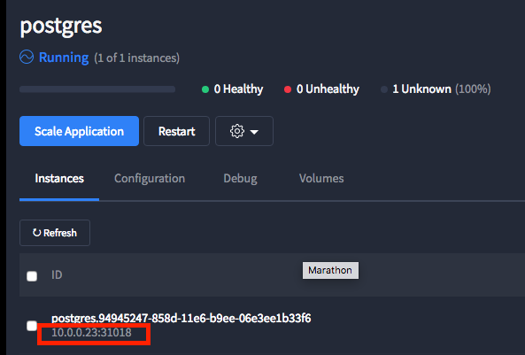

# Storage Persistence with Postgres using Mesos, Marathon, Docker, and REX-Ray

Watch Marathon do its thang!

### Prerequisites

- A functional Mesos environment with [Marathon Framework](https://mesosphere.github.io/marathon/). 
  - Examples: 
    - [3-Node ScaleIO + 3-Node Apache Mesos Cluster with Mesosphere](https://github.com/codedellemc/scaleio-framework/tree/master/demo)
- [REX-Ray must be installed](http://rexray.readthedocs.io/en/latest/) on each node Mesos Agent and [configured with the preemption flag](http://libstorage.readthedocs.io/en/stable/user-guide/config/#volume-configuration)
- Docker 1.12+ must be installed on each node

##### Other Information

Take a look at [Storage Persistence with Postgres using REX-Ray](https://github.com/codedellemc/demo/tree/master/demo-persistence-with-postgres-docker) to get more detailed information such as Pre-Creating Volumes if necessary.

### Deploy Postgres
Marathon can use cURL requests to its API for performing functions such as deploying applications. 

[postgres.json](postgres.json) will be used to deploy a Postgres container to Marathon. Marathon is responsible for deciding which host will run the application. Save this file to a location accessible from the terminal.

```
{
  "id": "postgres",
  "instances": 1,
  "cpus": 0.1,
  "mem": 32,
  "container": {
    "type": "DOCKER",
    "docker": {
      "image": "postgres:9.5",
      "network": "HOST",
      "forcePullImage": true
    },
    "volumes": [
      {
        "containerPath": "/var/lib/postgresql/data",
        "external": {
          "name": "postgres",
          "provider": "dvdi",
          "options": { "dvdi/driver": "rexray" }
        },
        "mode": "RW"
      }
    ]
  },
  "upgradeStrategy": {
    "minimumHealthCapacity": 0,
    "maximumOverCapacity": 0
  }
}
```

cURL to the Mesos Master:
```
curl -k -XPOST -d @postgres.json -H "Content-Type: application/json" http://<IPorDNS>:8080/v2/apps
```

**Note:** If the timeout is not set properly, the images can fail to deploy if the container image has not been downloaded. To overcome this limitation, on each Mesos node in the cluster, download the image before deployment
```
$ docker pull postgres:9.5
```

Go to the Marathon UI to see the deployment progress.

### Verify Volume Creation

SSH to the Mesos Agent where the container is currently running and be root
```
$ docker volume ls (will show volumes accessible by Docker)
$ sudo su
# cd /var/lib/rexray/volumes
# ls (should show postgres as being created as defined in the json)
# cd postgres/data
# ls (will show all the individual files)
# cd /var/lib/rexray/volumes
```


At this point, the Databases can be created and manipulated on the container. Follow the instructions to [Add A New Database](https://github.com/codedellemc/demo/tree/master/demo-persistence-with-postgres-docker#add-a-new-database).

### Restart Application
Within the Mesos UI, hit the `Restart` button to restart the application and Marathon will put it on a different host in the cluster.


On the previous host where the container was previously deployed, the `postgres` directory will remain but doing a `ls` will result in a `data` directory no longer being available. The data is now accessible on the new host. Follow the previous directions to [verify the volume was created](#verify-volume-creation).


### Verify The Application
Within the Mesos UI, after hitting the `Restart` button the failover took place and was restarted on a different node.

SSH to the new Mesos Agent:
```
$ sudo su
# cd /var/lib/rexray/volumes
# ls 
# cd postgres/data
# ls (will show all the individual files)
```

If a new database was created, [Verify the newly created database still exists](https://github.com/codedellemc/demo/tree/master/demo-persistence-with-postgres-docker#start-a-container-on-a-different-host).



## Contribution

Create a fork of the project into your own repository. Make all your necessary changes and create a pull request with a description on what was added or removed and details explaining the changes in lines of code. If approved, project owners will merge it.


## Support

Please file bugs and issues on the GitHub issues page for this project. This is to help keep track and document everything related to this repo. For general discussions and further support you can join the [{code} by Dell EMC Community slack channel](http://community.codedellemc.com/). The code and documentation are released with no warranties or SLAs and are intended to be supported through a community driven process.